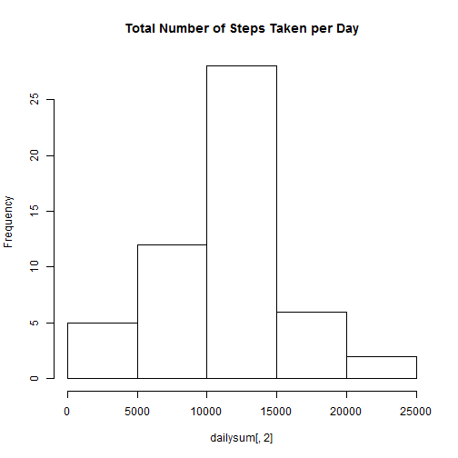
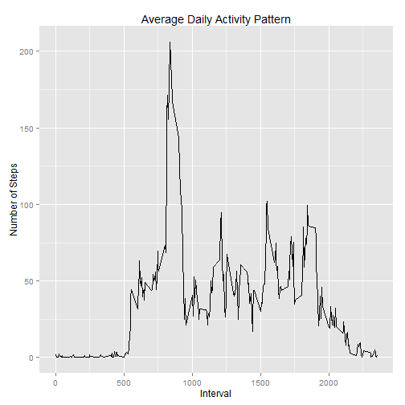
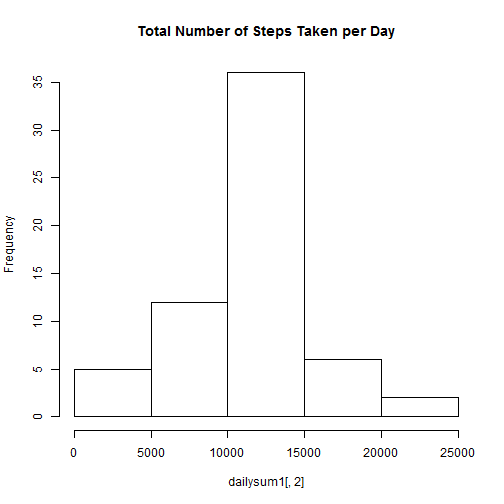
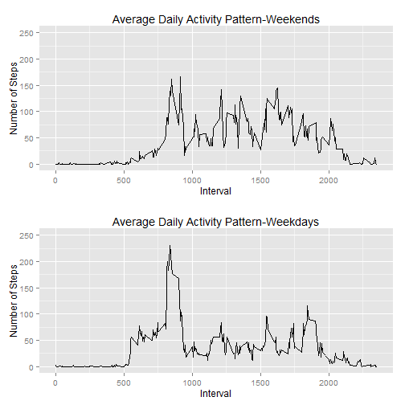

Loading and preprocessing the data
----------------------------------

The data has been loaded using the following code:


```r
activity<-read.csv("activity.csv")
```
The NA values have been removed for the first part of the assignment:


```r
activityc<-na.omit(activity)
```

What is mean total number of steps taken per day?
-------------------------------------------------


Using the Melt/Cast function enabled calculating the total, average and median number of steps taken per day:


```r
library(reshape)
dailysum<-cast(activitym, date~variable, sum)
hist(dailysum[,2], main="Total Number of Steps Taken per Day")
```

 

```r
meansteps<-mean(dailysum[,2])
medsteps<-median(dailysum[,2])
```

Median total number of steps per day was: 10765

Mean total number of steps per day was: 1.0766 &times; 10<sup>4</sup>


What is the average daily activity pattern?
--------------------------------------------


In order to plot the acerage daily activity pattern, we should first load the ggplot2 package.


```r
library(ggplot2)
```

```
## Warning: package 'ggplot2' was built under R version 3.0.3
```

```
## Need help? Try the ggplot2 mailing list: http://groups.google.com/group/ggplot2.
```

This time series plot illustrates the 5-minute interval and the average number of steps taken, averaged across all days:


```r
intmean<-cast(activitym, interval~variable, mean)
qplot(intmean$interval,intmean$steps, data=intmean, geom="line", main="Average Daily Activity Pattern", xlab="Interval", ylab="Number of Steps")
```

 

The 5-minute interval which, on average across all the days in the dataset, contains the maximum number of steps can be calculated usind the following code:


```r
maxpos<-which.max(intmean[,2])
intmax<-intmean[maxpos,1]
cat("The interval which, on average across all the days in the dataset, contains the maximum number of steps is: ",intmax)
```

```
## The interval which, on average across all the days in the dataset, contains the maximum number of steps is:  835
```

Imputing missing values
-----------------------

There are a number of days/intervals where there are missing values (coded as NA). The presence of missing days may introduce bias into some calculations or summaries of the data.

The total number of missing values in the dataset is calculated as follows:

```r
NACount<-nrow(activity)-nrow(activityc)
```

The number of missing values is: 2304


The missing values will be replaced by the mean of known values for the same 5-minute interval using the following code:

```r
for (i in 1:nrow(activity))
{
  if (is.na(activity$steps[i]))
  {
    curinterval<-activity$interval[i]
    intpos<-which(intmean$interval==curinterval)
    activity$steps[i]<-intmean$steps[intpos]
  }
}
```

To compare the effect imputing the missing values had on our results we are going to make a histogram of the total number of steps taken each day and calculate and report the mean and median total number of steps taken per day, using the following code: 


```r
activitym1<-melt(activity,id=c("date","interval"))
dailysum1<-cast(activitym1, date~variable, sum)
hist(dailysum1[,2], main="Total Number of Steps Taken per Day")
```

 


It would appear that imputting the values had an effect on the frequencies shown on the histogram, but the distribution appears unchanged.

Now, we are going to compare the  mean and median total number of steps taken per day:


```r
meansteps1<-mean(dailysum1[,2])
medsteps1<-median(dailysum1[,2])
```

The average calculated by ignoring the missing values was 1.0766 &times; 10<sup>4</sup>, vs. 1.0766 &times; 10<sup>4</sup>, calculated by replacing the missing values by the period average.

The median calculated by ignoring the missing values was 10765, vs. 1.0766 &times; 10<sup>4</sup>, calculated by replacing the missing values by the period average.


It is obvious that  imputing the average values had no effect on the mean over an interval, which is to be expected as the missing values were replaced by period means.

Are there differences in activity patterns between weekdays and weekends?
-------------------------------------------------------------------------

In order to answer this question, we will first create a new factor variable in the dataset with two levels - "weekday" and "weekend" indicating whether a given date is a weekday or weekend day, and then separate the data into two subsets (weekdays and weekends) using the following code:

```r
activity["weekends"]<-weekdays(as.Date((activity$date)))
activity[activity=="Monday"|activity=="Tuesday"|activity=="Wednesday"|activity=="Thursday"|activity=="Friday"]<-"Weekday"
activity[activity=="Saturday"|activity=="Sunday"]<-"Weekend"
activity$weekends<-as.factor(activity$weekends)
acweekends<-subset(activity, weekends=="Weekend")
acweekdays<-subset(activity, weekends=="Weekday")
```


Using the Melt/Cast function we will calculate the average number of steps taken for each 5-minute interval in both subset and finally plot them to using the following code:


```r
acweekendsm<-melt(acweekends,id=c("interval","date","weekends"))
acweekdaysm<-melt(acweekdays,id=c("interval","date","weekends"))
weekendsintmean<-cast(acweekendsm, interval~variable, mean)
weekdaysintmean<-cast(acweekdaysm, interval~variable, mean)

p1<-qplot(weekendsintmean$interval,weekendsintmean$steps, data=weekendsintmean, geom="line", main="Average Daily Activity Pattern-Weekends",xlab="Interval", ylab="Number of Steps")+ylim(0,250)
p2<-qplot(weekdaysintmean$interval,weekdaysintmean$steps, data=weekdaysintmean, geom="line", main="Average Daily Activity Pattern-Weekdays",xlab="Interval", ylab="Number of Steps")+ylim(0,250)
library(gridExtra)
```

```
## Warning: package 'gridExtra' was built under R version 3.0.3
```

```
## Loading required package: grid
```

```r
print(arrangeGrob(p1, p2, nrow=2))
```

 

It would appear that the number o fsteps taked in the morning is heigher on weekdays, while the number of steps taken throughout the rest of the day is somewhat higher on the weekends.
